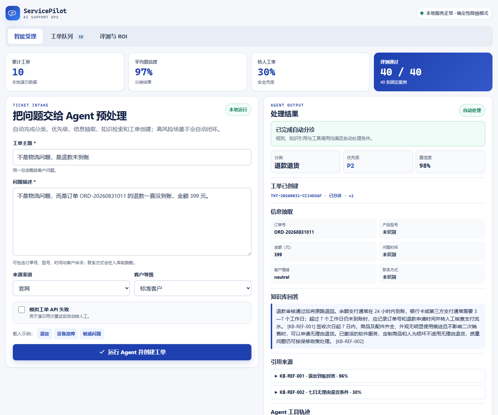

# ServicePilot AI

> 本地优先的消费电子售后工单 Agent：自动分类、优先级判断、信息抽取、带引用的 RAG 回答、工单 API 调用与安全转人工。

ServicePilot AI 是一个面向 FDE / AI 产品经理作品集的完整企业 AI MVP。它使用 Python 标准库、SQLite、虚构企业知识库和可选的本地 Ollama `qwen3.5:9b`，不需要云端 API Key。



## 核心能力

- 六类消费电子售后工单：退款退货、物流配送、设备故障、账号激活、支付发票、投诉建议。
- P0—P3 优先级判断，抽取订单号、型号、金额、时间、情绪与脱敏联系方式。
- 从 12 篇虚构企业知识文档检索回答，显示文档 ID、章节、片段、来源和相关度。
- Agent 通过受控工具层创建、查询及更新本地工单；创建支持幂等，更新使用版本号乐观锁。
- 低于 `0.72` 的置信度、敏感问题、知识缺口和工具失败自动转人工。
- Ollama 不可用时自动切换为确定性抽取式回答，工单流程仍可运行。
- 40 条固定评测集，展示分类、优先级、抽取、引用和转人工指标。
- 可复现的错误优化对比和明确标注假设的 ROI 计算器。

## 3 分钟体验

1. 在“智能受理”点击“退款”示例并提交，查看否定/转折识别、退款知识引用和工单创建。
2. 切换“敏感问题”，观察 P0 设备安全场景自动进入待人工队列。
3. 勾选“模拟工单 API 失败”，查看两次调用失败后的人工兜底。
4. 在“工单队列”更新状态，验证乐观锁版本递增。
5. 打开“评测与 ROI”，查看 40 条评测、Baseline→Optimized 和模拟收益。

完整演示视频发布在 GitHub Release；本地可复现工程、成片规格和终检记录见 [视频制作与交付](docs/VIDEO.md)，旁白稿见 [3 分钟演示脚本](docs/DEMO_SCRIPT.md)。

## 快速启动

要求：Windows PowerShell、Python 3.11+。在项目目录运行：

```powershell
powershell -ExecutionPolicy Bypass -File .\start.ps1
```

访问 [http://127.0.0.1:8770](http://127.0.0.1:8770)。默认使用确定性 RAG 降级模式，以获得稳定、快速的演示体验。

启用本地 Ollama 回答增强：

```powershell
powershell -ExecutionPolicy Bypass -File .\start.ps1 -EnableOllama
```

Ollama 只负责基于已检索片段重写回答；引用 ID 必须通过允许列表校验，模型不能绕过分类、优先级或转人工规则。

## 一键验收

```powershell
powershell -ExecutionPolicy Bypass -File .\run_checks.ps1
```

验收包括 36 个自动化测试、40 条固定评测和前端 JavaScript 语法检查。当前固定评测结果：

| 指标 | 结果 | 验收线 |
|---|---:|---:|
| 分类准确率 | 100% | ≥90% |
| 优先级准确率 | 100% | ≥90% |
| 信息抽取 F1 | 100% | ≥90% |
| 引用命中率 | 100% | ≥90% |
| 转人工召回率 | 100% | 100% |
| 正常工具成功率 | 100% | — |

这些结果仅代表仓库内的 40 条虚构固定案例，不等于生产泛化效果。详细结果见 [评测报告](outputs/evaluation.md) 和 [Bad Case](evals/BAD_CASES.md)。

## 错误到优化

输入：`不是物流问题，而是订单 ORD-20260831011 的退款一直没到账。`

- Baseline：从左到右遇到首个关键词就返回，误判为“物流配送”。
- Optimized：加入否定/转折权重，并按预测分类重排知识片段，正确输出“退款退货”并命中 `KB-REF-001`。

该对比由 `evaluate.py` 每次自动复现，不是手工填写截图。

## ROI 模拟

默认假设：1000 单/月、人工 8 分钟/单、自动处理率 55%、自动处理 1.5 分钟、人工复核 3 分钟、人工时薪 60 元、一次解决率 68%→78%。

- 加权新时长：`55% × 1.5 + 45% × 3 = 2.175 分钟/单`
- 月节省时间：`1000 × (8 - 2.175) ÷ 60 ≈ 97.1 小时`
- 月人工成本改善：`97.1 × 60 ≈ 5825 元`
- 一次解决率改善：`+10 个百分点`

这是可调的模拟模型，不代表真实企业收益。生产试点必须用真实工单量、AHT、人工成本和 FCR 替换假设。

## 架构与文档

- [系统架构](docs/ARCHITECTURE.md)
- [API 文档](docs/API.md)
- [部署步骤](docs/DEPLOYMENT.md)
- [安全与权限边界](docs/SECURITY.md)
- [3 分钟演示脚本](docs/DEMO_SCRIPT.md)
- [视频制作与交付](docs/VIDEO.md)

```text
support-ticket-agent/
├─ app.py                 本地 HTTP 服务
├─ engine.py              分类、抽取、RAG 与 Agent 编排
├─ ticket_store.py        SQLite、幂等与乐观锁
├─ ollama_client.py       可选本地模型增强
├─ knowledge/             12 篇虚构企业知识文档
├─ web/                   响应式工作台
├─ evals/                 40 条案例与 Bad Case
├─ tests/                 自动化测试
├─ outputs/               可重复生成的评测报告
├─ docs/                  架构、API、部署与安全说明
└─ video/                 Ink Press 视频工程与交付物
```

## 安全边界

- 仅绑定 `127.0.0.1`；Docker 部署需自行配置企业网络与鉴权。
- 工单文本被视为不可信数据，不能改变系统规则或伪造知识引用。
- 数据库只保存脱敏后的正文；日志不记录请求体。
- Agent 不自动关闭高风险工单，也不替人工承诺退款、赔偿或安全处置。
- 仓库中的制度、客户、订单和收益全部为虚构演示内容。

## English summary

ServicePilot AI is a local-first enterprise support-ticket agent demo for consumer electronics. It classifies tickets, assigns priority, extracts structured information, answers with verifiable RAG citations, calls a controlled ticket API, and escalates low-confidence, sensitive, or failed-tool cases to a human. The repository includes a 40-case evaluation suite, a reproducible before/after optimization, an editable ROI simulator, deployment docs, and a three-minute product video.

## License

MIT. See [LICENSE](LICENSE).
