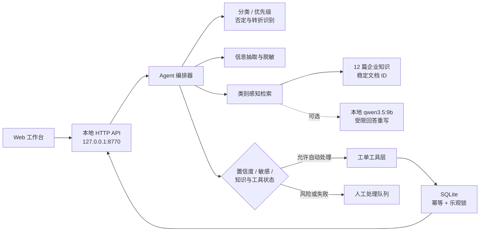

# 系统架构

## 数据流

1. 页面向 `POST /api/agent/run` 提交主题、问题描述和演示元数据。
2. 分类器按可解释权重输出类别、置信度和命中关键词；否定/转折后的正向分句获得更高权重。
3. 抽取器识别业务字段，联系方式和疑似卡号在入库前被掩码。
4. RAG 以问题文本和预测类别检索知识文档，返回前 3 个候选及稳定来源。
5. 可选 Ollama 只能使用候选片段重写回答；模型返回的引用必须属于候选允许列表。
6. 路由器检查 `0.72` 置信度阈值、敏感词、知识分数与工具状态。
7. 自动路径调用工单工具；人工路径仍创建 `awaiting_human` 工单，保留原因和可审计轨迹。

## 关键设计选择

- **规则负责边界，模型负责表达**：P0 安全问题、状态枚举和引用允许列表不交给模型判断。
- **可降级**：Ollama 离线时使用知识片段直接组成回答，不影响 API 和工单存储。
- **可追溯**：API 返回步骤、状态和简短事实，不暴露隐藏推理过程。
- **可替换边界**：生产化时可替换知识检索、模型网关和工单存储，而不改变路由策略。
